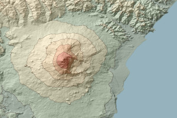
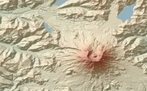
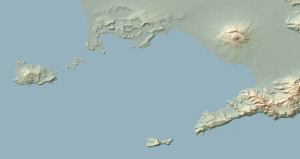
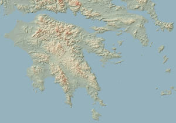
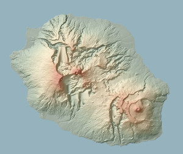
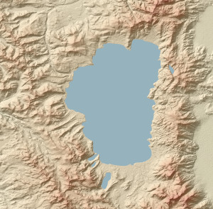
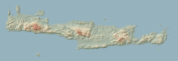
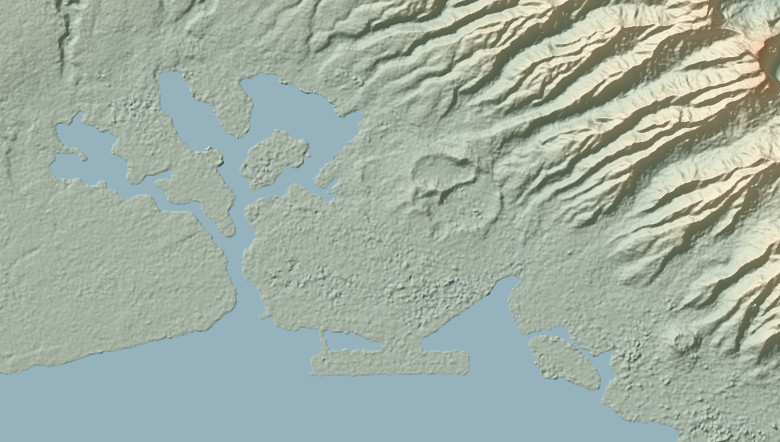
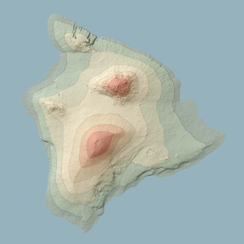
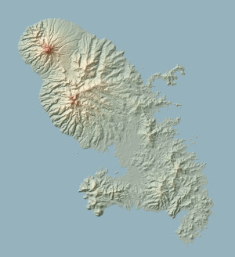

# Make Relief Map

An elevation map shows elevation data with color. The colors don't reflect the natural landscape (it is not a satellite map), but all the points at a given altitude have the same color. Sometimes, contour lines are added at regular altitude interval to show the steepness: if two lines are close from each other, the slope is steep.

Here are some example:

<table>
   <tr>
      <td></td>
      <td></td>
   </tr>
   <tr>
      <td></td>
      <td></td>
   </tr>
   <tr>
      <td></td>
      <td></td>
   </tr>
   <tr>
      <td></td>
      <td></td>
   </tr>
   <tr>
      <td></td>
      <td></td>
   </tr>
</table>

To make these maps, I used data used are from NASA (SRTM 1 and 3), and [LandSerf](http://www.staff.city.ac.uk/~jwo/landserf/).  I provide a [Jupyter Notebook](elevation_map_maker.ipynb) that download the data from the NASA website and produced the scripts to be executed by LandSerf, so these maps are done in a few seconds.

If you want to read the raw data from NASA, and get an image out of them without LandSerf, check out [this other repository of mine: `hgt2pnm`](https://github.com/boberle/hgt2pnm).

Before the notebook, I used Perl scripts, also provided here (see the `perl_scripts` directory).

